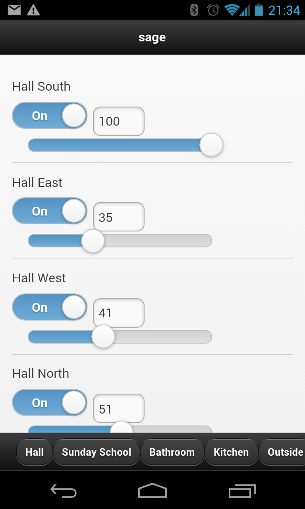
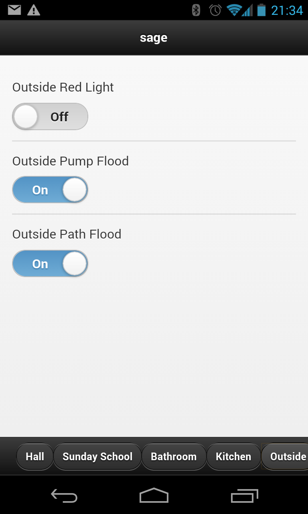
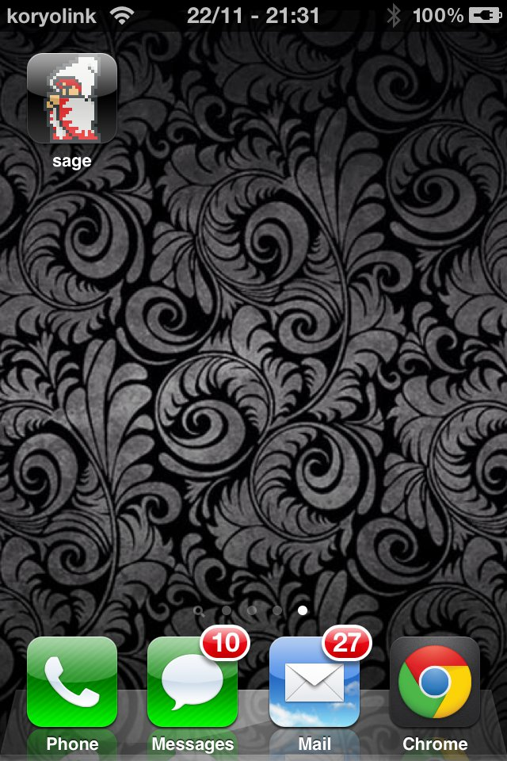
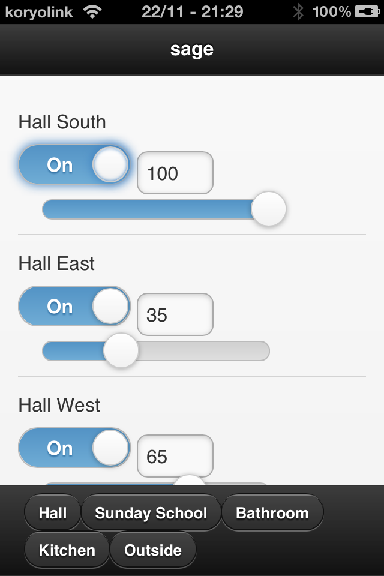
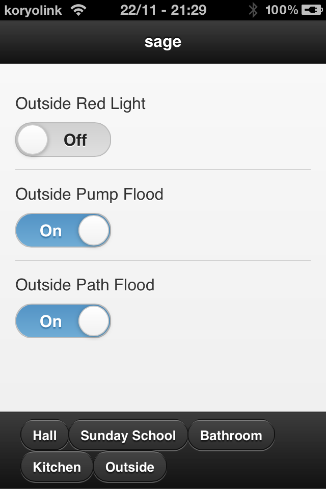

****
sage
****

sage is a web interface for lighting controls, similar to :doc:`Wiser <wiser-swf-protocol>`, except it doesn't suck:

- It has no dependancy on Flash player or a device-specific app (it uses WebSockets instead).
- It has a very minimalist, touch-friendly UI based on jQuery Mobile.  This UI is also used on desktop.
- It works as a "web app" on iOS 4.2 and later (due to patchy WebSockets support).
- It has no requirement for a ethernet-based PCI (serial/USB are fine).
- It doesn't have hard coded backdoors and changing the password actually locks previous users out.  (However some browsers don't implement support for HTTP Authentication requests on WebSockets)

It connects to :doc:`cdbusd <daemons.cdbusd>` as it's abstraction layer, and only presents lighting events to clients.

It is made of some parts:

- ``saged`` which is a backend WebSockets server that translates WebSockets messages into messages in cdbusd, and implements some basic access controls.
- ``sageclient.js`` which implements the saged WebSockets protocol in JavaScript.
- ``sageui.js`` which implements the UI of sage itself, which is built on jQuery Mobile.

Running
=======

sage requires that you have a running instance of :doc:`cdbusd <daemons.cdbusd>` first.

Once running, copy the resources in :file:`cbus/sage_root` into a web-accessible folder on the same computer where you will run sage.

.. note:: If you are serving the files from HTTPS, you may also need a way to make sage's WebSockets service accessible by HTTPS (wss), due to browser security constraints.  sage does not support this yet, so the sage files need to be all served via HTTP.

Then start up the :program:`sage` daemon::

	$ python -m cbus.daemons.saged -H 192.0.2.1 -W

Where ``192.0.2.1`` is your server's LAN IP address.  This will run a WebSockets server on port 8080.

.. note:: Don't expose sage to the internet.  Anyone on the internet will be able to use sage if you do this.  Always use a VPN to access sage remotely.

You then need to create a project file called :file:`project.json` in your sage_root folder.  This file is in JSON format.  As an example:

.. code-block:: javascript

	{
	  "saged": "ws://192.0.2.1:8080/",
	  "locations": {
	    "0": "Living Areas",
	    "1": "Bedrooms",
	    "2": "Outside"
	  },
	 
	  "widgets": {
	    "1": {
	       "name": "Kitchen",
	       "type": "switch",
	       "locations": {"0": 1}
	    },
	    "2": {
	      "name": "Patio",
	      "type": "switch",
	      "locations": {"0": 100, "2": 1}
	    }
	  }
	}

The important elements of the configuration are:

- ``saged``: The URI of the WebSockets server.  When running saged without the ``-W`` option (in standalone mode), the WebSockets server listens on ``/saged``, not the root path..
- ``locations``: A dictionary of locations, with the key representing the ID of the location, and the value representing the name to display.  Location ``0`` must exist, and is shown by default.
- ``widgets``: A dictionary of group addresses describing what widgets to display. 

  - The key is the group address to control.
  - The option ``name`` sets the name to display in the UI.
  - The option ``type`` selects the type of widget to use:
  
    - ``switch`` displays a simple switch
    - ``slider`` displays a slider.
    - ``switch_slider`` displays both a switch and a slider.

  - The option ``locations`` is a dictionary which sets the locations where the widget should be displayed (indicated by the key), and the order in which it should be shown (indicated by the value, higher values are shown lower in the list).

.. note:: By default, constraints shown here about widget types are not enforced on the server side, and any group address may be sent commands.

  If there are group addresses you wish to restrict access to, use the ``-a`` option to :program:`sage` to only allow certain group addresses and deny all others (whitelist), or ``-d`` to deny certain group addresses and allow all others (blacklist).

Other options
=============

:program:`sage`'s daemon also supports some other options:

- ``-H`` and ``-p`` control the listening IP address and port that :program:`sage` uses.
- ``-W`` turns off sage's own internal web server for static files, and makes the WebSockets resource the root of the web server.  Normally, the WebSockets server is located at ``/saged``.
- ``-r`` allows you to specify the root directory of the web server for static resources, if ``-W`` is not specified.
- ``-a`` allows specifying a comma-seperated list of group addresses to allow control of through sage, and deny all others.
- ``-d`` allows specifying a comma-seperated list of group addresses to deny control of through sage, and allow all others.
- ``-S`` connects to :doc:`cdbusd <daemons.cdbusd>` through the D-Bus Session Bus rather than the System Bus.  This is useful for unprivileged testing.
- ``-P`` allows you to specify a ``.htpasswd``-format password file for saged to authenticate users against.  This does not work in `Chrome due to a bug (#123862)`__.
- ``-R`` allows you to set the HTTP Basic authentication realm (when using ``-P``).

__ https://code.google.com/p/chromium/issues/detail?id=123862

Screenshots
===========

Android (Chrome)
----------------

iOS "Web App"
-------------

